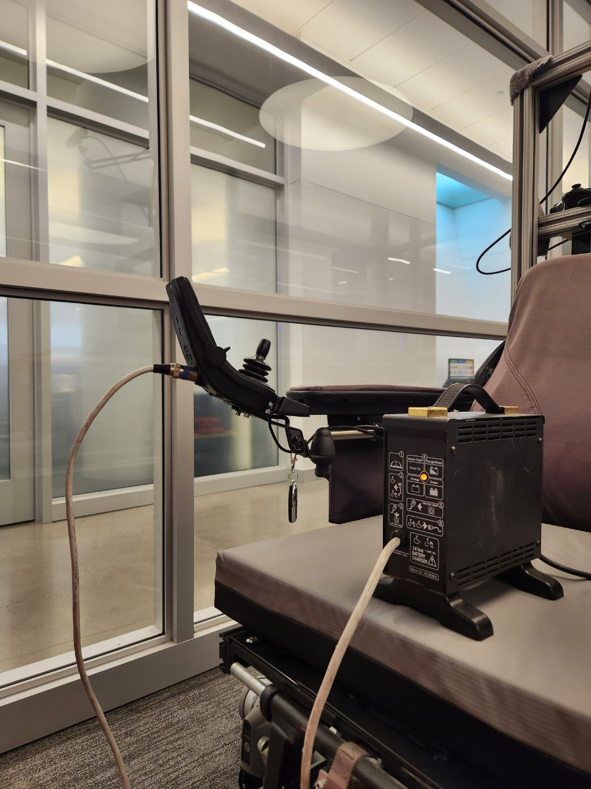
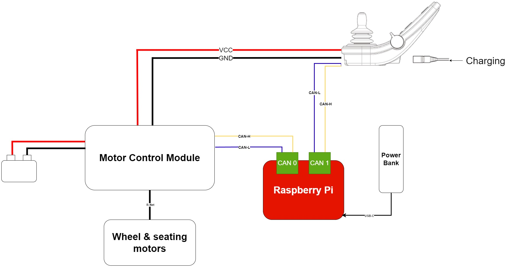
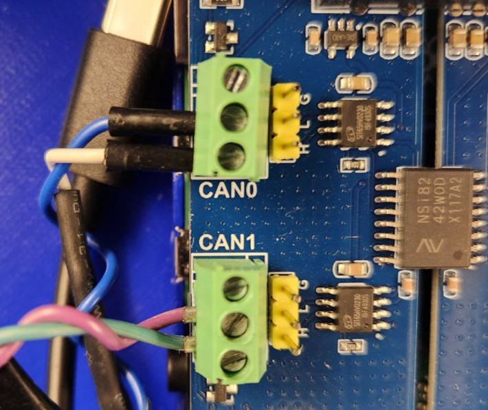

# Teleoperable power wheelchair for micromobility research using ROS

This repository contains the code and documentation for a teleoperable power wheelchair used as a platform for micromobility research. Any power wheelchair that uses the R-net control system can be modified to be teleoperable using the code and setup steps described in this repository.


## Table of Contents
- [Teleoperable power wheelchair for micromobility research using ROS](#teleoperable-power-wheelchair-for-micromobility-research-using-ros)
  - [Table of Contents](#table-of-contents)
- [Usage](#usage)
  - [Initialization](#initialization)
  - [Controls](#controls)
  - [Charging the wheelchair](#charging-the-wheelchair)
  - [Common troubleshooting steps](#common-troubleshooting-steps)
- [Hardware setup](#hardware-setup)
  - [Hardware components](#hardware-components)
    - [Component setup](#component-setup)
- [Raspberry Pi setup](#raspberry-pi-setup)
    - [Update packages and clone repository](#update-packages-and-clone-repository)
  - [Optional WiFi configuration](#optional-wifi-configuration)
  - [Setup CAN interface](#setup-can-interface)
  - [Setup IMU](#setup-imu)
  - [Setup Docker](#setup-docker)
    - [Install Docker](#install-docker)
    - [Setup Docker container for ROS 1 Noetic](#setup-docker-container-for-ros-1-noetic)

---

# Usage

## Initialization

1. Power on the Raspberry Pi by connecting it to a power bank. The LEDs on the RPi should light up.
2. Connect the ethernet cable from the Raspberry Pi to the laptop running the ROS master node.
3. Connect the Xbox gamepad to the laptop.
4. In the meantime, start programs on the laptop:
     - Run the docker container:
       ```bash
       docker start wheelchair
       docker exec -it wheelchair bash
       ```
     - Start the ROS master node:
       ```bash
       roscore
       ```
     - For each of the following commands, open a new terminal window and run the command in the Docker container:
       - For simple teleoperation using gamepad, without data collection functionality:
         ```bash
         python wheelchair_control.py
         ```
       - For streaming RGB-D camera data. **This is needed for data collection and inference**:
         ```bash
         python zed_streamer.py
         ```
       - For data collection:
         ```bash
         python expert_data_collection.py <EXP_NAME>
         ```
       - For testing trained BC model on the wheelchair:
         ```bash
         python inference_wheelchair.py <EXP_NAME>
         ```
       - For running the UI to visualize camera feed and control:
         ```bash
         cd gogogo
         python rl_env_ui.py
         ```
5. Start programs on Raspberry Pi
     - SSH into the Raspberry Pi ``` ssh pi@192.168.1.2```
     - Start the Docker container:
       ```bash
       docker start wheelchairpi
       docker exec -it wheelchairpi bash
       ```
     - Run the shared control node:
       ```bash
       python3 shared_control_wheelchair.py
       ```
     - After running the above python script, turn the wheelchair on. This can only be done after the shared control node is running, as it is needed for forwarding CAN messages.


## Controls

Teleoperate the Xbox 360-like controller plugged into the laptop running the ROS master node, placed here for reference.

- **Left-Joystick: Move wheelchair. Forward and rotaion**
- **RB: Increase speed level**
- **LB: Decrease speed level**
- **Green (A): Sound horn**
- **Red (B): Begin recording (data collection) or toggle AI control (inference)**
- **Back**: Emergency stop. Cuts off CAN communication which stops the wheelchair immediately.


## Charging the wheelchair

The charging port for the wheelchair is behind the joystick module (JSM). The LED on the charging port will be orange when the wheelchair is charging, and will turn green when the wheelchair is fully charged.




## Common troubleshooting steps

1. To check if both CAN interfaces are working:
   1. Turn the wheelchair *OFF*.
   2. Run:
       ```bash
        sudo -i
        cangw -F
        cangw -S can0 -A can1
        cangw -S can1 -A can0
        ```
    3. Turn the wheelchair on. If the CAN interfaces are working, the wheelchair should successfully power on and can be controlled using the on-board JSM.
    4. If the wheelchair does not power on or shows an error:
       1. Restart the Raspberry Pi.
       2. Check the CAN connections to ensure they are properly connected.
       3. Make sure the resistors on the CAN Hat are set to **0 Ohms**.
  
2. If you encounter `JSM DIME Error` when turning the wheelchair on:
   1. The JSM likely failed to complete the initialization process. Turn the wheelchair off and restart the shared control node on the Raspberry Pi.
   2. Make sure that the shared control node is the only program forwarding CAN messages to the wheelchair. If there are multiple programs forwarding CAN messages, it can cause conflicts and errors.
      1. Flush all cangw connections by running:
         ```bash
         sudo -i
         cangw -F
         ```
  
---

# Hardware setup

The wheelchair platform has been setup by referencing the [can2RNET](https://github.com/redragonx/can2RNET) library authored by Stephen Chavez. The following steps are a summary of the setup process.



## Hardware components
1. R-net compatible power wheelchair (e.g. Permobil M3)
2. Raspberry Pi 4 Model B (or equivalent) 64-bit with WiFi
3. [2 channel RPi CAN Hat](https://www.waveshare.com/2-ch-can-hat.htm)
4. Xbox 360-like controller
5. Ethernet cable
6. R-net cables and JSM module

### Component setup

1. **2 Channel CAN Hat**: Attach the CAN expansion board to the Raspberry Pi 4 via the GPIO pins.
2. **R-net cables**: The R-net cables need to be connected to the CANBUS terminal blocks. 
   1. **CAN 0:** Cable running from the JSM module to the RPi, carefully splice the cable to only break the connections for blue and white wires. Leave the red and black wires intact as they are used for power.
    ```
       BLUE -> CAN_L
      WHITE -> CAN_H
    ```
   2. **CAN 1:** Cable running from the RPi to the motor controllers, cut and strip the cables to reveal the four conductors inside. Connect the conductors to the appropriate pins on the CAN expansion board. 
    ```
      PURPLE -> CAN_L
       GREEN -> CAN_H
    ```



---

# Raspberry Pi setup
Using [Raspberry Pi Imager](https://www.raspberrypi.com/software/), install **Ubuntu Server 22.04 LTS 64-bit**. Set the hostname and username for the RPi. Make sure to also set up WiFi and SSH during the installation process. This is important for setting up the Raspberry Pi headlessly.

Once the image has been installed, the RPi should automatically connect to the network upon bootup. SSH into the Raspberry Pi using the set username and password before proceeding with the following steps.

### Update packages and clone repository

```bash
sudo apt update && apt upgrade
sudo apt install git
git clone https://github.com/PierceCCH/project-wheelchair.git
```

## Optional WiFi configuration

If you want to add another WiFi network to the Raspberry Pi, follow these steps:

1. `sudo nano /etc/netplan/50-cloud-init.yaml` 
2. Add WiFi configuration following format the previous
3. `sudo netplan generate`
4. `sudo netplan apply`

## Setup CAN interface

1. Add the following to `/boot/firmware/config.txt`:
    ```
    # Enable 2 channel CANBUS
    dtparam=spi=on
    dtoverlay=mcp2515-can0,oscillator=16000000,interrupt=23
    dtoverlay=mcp2515-can1,oscillator=16000000,interrupt=25
    dtoverlay=spi-bcm2835-overlay
    ```

2. Add the following lines under file `/etc/network/interfaces`
   ```
    allow-hotplug can0
    iface can0 can static
            bitrate 125000
            up /sbin/ip link set $IFACE down
            up /sbin/ip link set $IFACE up

    allow-hotplug can1
    iface can1 can static
            bitrate 125000
            up /sbin/ip link set $IFACE down
            up /sbin/ip link set $IFACE up
   ```

3. Add the following to `/etc/systemd/network/80-can.network`
   ```
    [Match]
    Name=can0
    [CAN]
    BitRate=125K

    [Match]
    Name=can1
    [CAN]
    BitRate=125K
   ```
4. Add these kernel modules under /etc/modules
    ```
    mcp251x
    can_dev
    ```

5. **Reboot the Raspberry Pi**, then test for the CAN interface by running `ifconfig`. You should see both `can0` and `can1` listed.

6. Install CAN-UTILS. Once installed, you can read from the CAN interfaces by running `candump can0 -L`.

    ```
    sudo apt-get install can-utils
    ```

## Setup IMU


An IMU is used to provide information about the wheelchair's orientation and position.

1. Connect the IMU to the Raspberry Pi GPIO pins as follows:
   - **VCC**: 3.3V (Pin 1)
   - **GND**: Ground (Pin 6)
   - **SDA**: SDA (Pin 3)
   - **SCL**: SCL (Pin 5)
2. Add the following to `/boot/firmware/config.txt`:
    ```
    dtparam=i2c_arm=on
    i2c_arm_baudrate=1000000
    ```
3. Validate that the IMU is connected by running:
    ```bash
    sudo i2cdetect -y 1
    ```
   You should see the address `0x68` for MPU6050
4. Install the required python packages:
    ```bash
    sudo pip3 install smbus2
    sudo pip3 install mpu9250-jmdev
    ```

## Setup Docker

### Install Docker

1. Install Docker dependencies:
  
```bash
sudo apt install apt-transport-https ca-certificates curl gnupg-agent software-properties-common
```

2. Add Docker's official GPG key:

```bash
curl -fsSL https://download.docker.com/linux/ubuntu/gpg | sudo apt-key add -
```

3. Set up the stable repository:

```bash
sudo add-apt-repository "deb [arch=amd64] https://download.docker.com/linux/ubuntu bionic stable"
```

4. Install Docker Engine:

```bash
sudo apt update
sudo apt install docker-ce docker-ce-cli containerd.io
```

5. Add your user to the Docker group:

```bash
sudo usermod -aG docker $USER
su - $USER
```

6. Verify that Docker is installed correctly:

```bash
docker --version
```

### Setup Docker container for ROS 1 Noetic

For this project, ROS 1 Noetic running on Ubuntu 20.04 is used. We will use a pre-built Docker image for this.

1. Pull the Docker image:

```bash
docker pull noetic-ros-core
```

1. Create and run a Docker container:

```bash
./run_docker.sh
```

3. Install python3 for the container:
  
```bash
sudo apt-get install python3.10
```

4. Find the IP address of both the Raspberry Pi and master node (e.g your laptop) by running:

```bash
hostname -I
```

5. Add the following to the `~/.bashrc` file:

```bash
export ROS_MASTER_URI=http://<IP address of MASTER_NODE>:11311
export ROS_IP=<IP address of the Raspberry Pi>
```

6. Commit the changes to a new Docker image, in case you need to create a new container in the future:
  
```bash
docker commit wheelchairpi noetic-ros-wheelchair:latest
```

7. In the future, you can start the Docker container by running, and the container will have the correct ROS environment variables set:

```bash
docker start wheelchairpi
docker exec -it wheelchairpi bash
```
