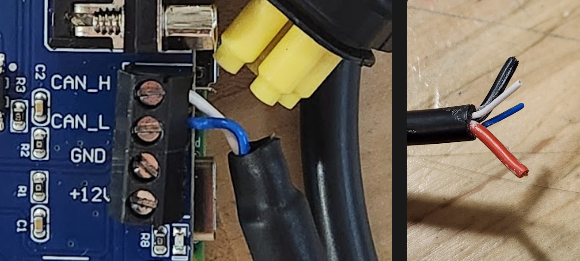

# Teleoperable power wheelchair for micromobility research using ROS

This repository contains the code and documentation for a teleoperable power wheelchair used as a platform for micromobility research. Any power wheelchair that uses the R-net control system can be modified to be teleoperable using the code and setup steps described in this repository.

  

## Table of Contents

- [Teleoperable power wheelchair for micromobility research using ROS](#teleoperable-power-wheelchair-for-micromobility-research-using-ros)
  - [Table of Contents](#table-of-contents)
- [Usage](#usage)
    - [Controls](#controls)
- [Hardware setup](#hardware-setup)
  - [Hardware components](#hardware-components)
    - [Component setup](#component-setup)
- [Raspberry Pi setup](#raspberry-pi-setup)
    - [Update packages and clone repository](#update-packages-and-clone-repository)
  - [Optional WiFi configuration](#optional-wifi-configuration)
  - [Setup CAN interface](#setup-can-interface)
  - [Setup Docker](#setup-docker)
    - [Install Docker](#install-docker)
    - [Setup Docker container for ROS 1 Noetic](#setup-docker-container-for-ros-1-noetic)

---

# Usage

1. Complete the setup steps for the hardware and Raspberry Pi.
2. Start the ROS master node on your laptop or another computer. If the master node is not started, the control publisher node will not be able to communicate with the wheelchair controller node.
3. SSH into the Raspberry Pi.
4. Start the Docker container:
  ```bash
  docker start wheelchairpi
  docker exec -it wheelchairpi bash
  ```
5. Start the wheelchair controller node:
  ```bash
  python3 wheelchair_ros.py
  ```

### Controls

These controls are for the Xbox 360-like controller plugged into the laptop running the ROS master node, placed here for reference. They are not for the wheelchair controller node running on the Raspberry Pi.

- **Left-Joystick: Move wheelchair**
- **LB: Increase speed level**
- **RB: Decrease speed level**
- **Green (A): Sound horn**
- **Red (B): Toggle AI control (WIP)**

---

# Hardware setup

The wheelchair platform has been setup by referencing the [can2RNET](https://github.com/redragonx/can2RNET) library authored by Stephen Chavez. The following steps are a summary of the setup process.

## Hardware components
1. R-net compatible power wheelchair (e.g. Permobil M3)
2. Raspberry Pi 4 Model B (or equivalent) 64-bit with WiFi and Bluetooth
3. [PiCAN 2 Board](http://copperhilltech.com/pican-2-can-interface-for-raspberry-pi/) with R-net cable
4. Xbox 360-like controller
5. Ethernet cable and or WiFi router

### Component setup

1. **PiCAN 2 Board**: Attach the PiCAN 2 board to the Raspberry Pi 4. The board should be connected to the GPIO pins of the Raspberry Pi.
2. **R-net cable**: The R-net cable needs to be connected to the PiCAN 2 board. Cut and strip the cable to reveal the four conductors inside. Connect the conductors to the appropriate pins on the PiCAN 2 board.
  
  
  
  ```
    RED -> +12V (optional without SMPS)
    BLK -> GND  (optional without SMPS)
    BLU -> CAN_L
    WHT -> CAN_H
  ```

---

# Raspberry Pi setup
Using [Raspberry Pi Imager](https://www.raspberrypi.com/software/), install **Ubuntu Server 22.04 LTS 64-bit**. Set the hostname and username for the RPi. Make sure to also set up WiFi and SSH during the installation process. This is important for setting up the Raspberry Pi headlessly.

Once the image has been installed, the RPi should automatically connect to the network upon bootup. SSH into the Raspberry Pi using the set username and password before proceeding with the following steps.

### Update packages and clone repository

```bash
sudo apt update && apt upgrade
sudo apt install git
git clone https://github.com/PierceCCH/project-wheelchair.git
```

## Optional WiFi configuration

If you want to add another WiFi network to the Raspberry Pi, follow these steps:

1. `sudo nano /etc/netplan/50-cloud-init.yaml` 
2. Add WiFi configuration following format the previous
3. `sudo netplan generate`
4. `sudo netplan apply`

## Setup CAN interface

1. Add the following to `/boot/firmware/config.txt`:
    ```
    dtparam=spi=on 
    
    dtoverlay=mcp2515-can0,oscillator=16000000,interrupt=25         
    dtoverlay=spi-bcm2835
    ```

2. Add the following lines under file /etc/network/interfaces
   ```
   allow-hotplug can0
   iface can0 can static
           bitrate 125000
           up /sbin/ip link set $IFACE down
           up /sbin/ip link set $IFACE up
   ```

3. Add the following to `/etc/systemd/network/80-can.network`
   ```
   [Match]
   Name=can0
   
   [CAN]
   BitRate=125K
   ```
4. Add these kernel modules under /etc/modules
    ```
    mcp251x
    can_dev
    ```

5. **Reboot the Raspberry Pi**, then test for the CAN interface by running `ifconfig`. You should see a `can0` interface listed.

6. Install CAN-UTILS. Once installed, you can read from the CAN interface by running `candump can0 -L`.

    ```
    sudo apt-get install can-utils
    ```

## Setup Docker

To simplify the process of running different ROS versions, we will use Docker.

### Install Docker

1. Install Docker dependencies:
  
```bash
sudo apt install apt-transport-https ca-certificates curl gnupg-agent software-properties-common
```

2. Add Docker's official GPG key:

```bash
curl -fsSL https://download.docker.com/linux/ubuntu/gpg | sudo apt-key add -
```

3. Set up the stable repository:

```bash
sudo add-apt-repository "deb [arch=amd64] https://download.docker.com/linux/ubuntu bionic stable"
```

4. Install Docker Engine:

```bash
sudo apt update
sudo apt install docker-ce docker-ce-cli containerd.io
```

5. Add your user to the Docker group:

```bash
sudo usermod -aG docker $USER
su - $USER
```

6. Verify that Docker is installed correctly:

```bash
docker --version
```

### Setup Docker container for ROS 1 Noetic

For this project, ROS 1 Noetic running on Ubuntu 20.04 is used. We will use a pre-built Docker image for this.

1. Pull the Docker image:

```bash
docker pull noetic-ros-core
```

2. Create and run a Docker container:

```bash
docker run -it --name wheelchairpi -v /dev:/dev -v /home/pi/project-wheelchair:/home --network host --privileged noetic-ros-core
docker exec -it wheelchairpi bash
```

3. Install python3 for the container:
  
```bash
sudo apt-get install python3.10
```

4. Find the IP address of both the Raspberry Pi and master node (e.g your laptop) by running:

```bash
hostname -I
```

5. Add the following to the `~/.bashrc` file:

```bash
export ROS_MASTER_URI=http://<IP address of MASTER_NODE>:11311
export ROS_IP=<IP address of the Raspberry Pi>
```

6. Commit the changes to a new Docker image, in case you need to create a new container in the future:
  
```bash
docker commit wheelchairpi noetic-ros-wheelchair:latest
```

7. In the future, you can start the Docker container by running, and the container will have the correct ROS environment variables set:

```bash
docker start wheelchairpi
docker exec -it wheelchairpi bash
```
